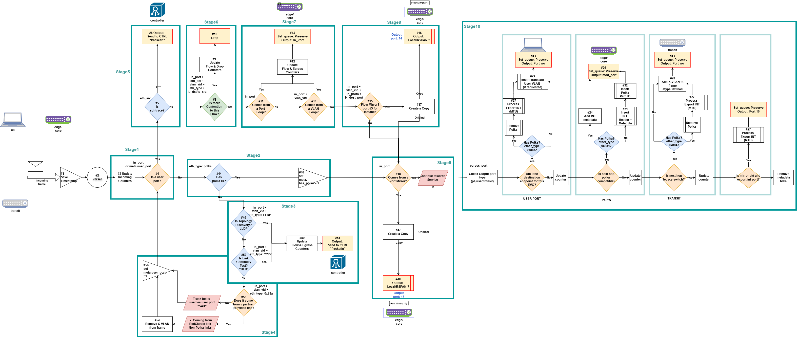

# INT-P4-Project

Welcome to the INT-P4-Project repository!

The current implementation is available in the [v1.6](./v1.6/) folder

#### Versioning
* 📌 Current version: v1.6
* 📁 Past versions can be found in the [past-versions](./past-versions) directory.

The current pipeline structure (v1.6) is illustrated below:

#### Pipeline Stages

The pipeline is composed of the following sequential stages:

* Stg1 | User port?
* Stg2 | has Polka ID?
* Stg3 |Topology Discovery?
* Stg3 | Link continuity test?
* Stg4 | Partner-provided link?
* Stg5 | SDN trace?
* Stg6 | Contention flow?
* Stg7 | Port loop?
* Stg7 | Vlan Loop?
* Stg8 | Flow mirror?
* Stg9 | Port mirror?
* Stg10 | IG:Has Polka. Export INT?
* Stg10 | Set output port type
* Stg10 | Am I destination endpoint?
* Stg10 | Endpoint action
* Stg10 | Is next hop polka-compatible?
* Stg10 | Is next hop legacy switch?
* Stg10 | EG:Is mirror pkt and export int port?

