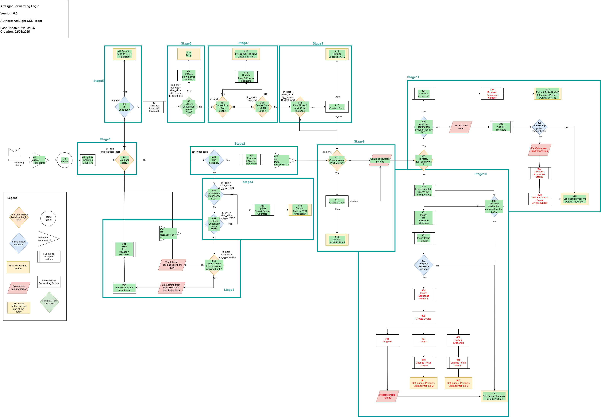

# INT-P4-Project

Welcome to the INT-P4-Project repository!

The current implementation is available in the [v1.6](./v1.6/) folder

#### Versioning
* 📌 Current version: v1.6
* 📁 Past versions can be found in the [old-versions](./old-versions) directory.

The current pipeline structure (v1.6) is illustrated below:

#### Pipeline Stages

The pipeline is composed of the following sequential stages:

* Stg1 – Is it a user port?
* Stg2 – Has a Polka ID?
* Stg3 – Topology discovery?
* Stg3 – Link continuity test?
* Stg4 – Partner-provided link?
* Stg5 – SDN trace?
* Stg6 – Contention flow?
* Stg7 – Port loop?
* Stg7 – VLAN loop?
* Stg8 – Flow mirror?
* Stg9 – Port mirror?
* Stg10 – No Polka: Destination endpoint?
* Stg11 – Polka: Destination endpoint?

