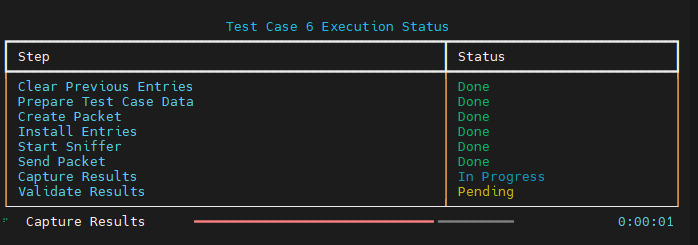
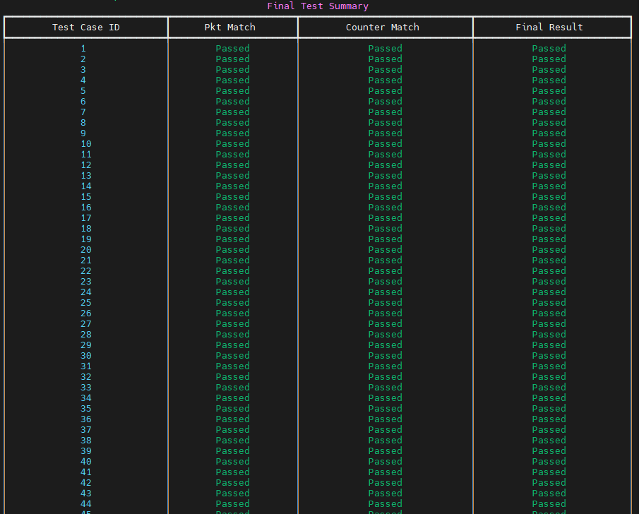

# INT-P4-Project

Welcome to the INT-P4-Project repository!

The current implementation is available in the [v1.6](./v1.6/) folder

#### Versioning
* 📌 Current version: v1.6
* 📁 Past versions can be found in the [past-versions](./past-versions) directory.
- [v1.1](./past-versions/v1.1)
- [v1.2](./past-versions/v1.2)
- [v1.3](./past-versions/v1.3)
- [v1.4](./past-versions/v1.4)
- [v1.5](./past-versions/v1.5)

The current pipeline structure (v1.6) is illustrated below:


#### Pipeline Stages

The pipeline is composed of the following sequential stages:

* Stg1 | User port?
* Stg2 | has Polka ID?
* Stg3 |Topology Discovery?
* Stg3 | Link continuity test?
* Stg4 | Partner-provided link?
* Stg5 | SDN trace?
* Stg6 | Contention flow?
* Stg7 | Port loop?
* Stg7 | Vlan Loop?
* Stg8 | Flow mirror?
* Stg9 | Port mirror?
* Stg10 | IG:Has Polka. Export INT?
* Stg10 | Set output port type
* Stg10 | Am I destination endpoint?
* Stg10 | Endpoint action
* Stg10 | Is next hop polka-compatible?
* Stg10 | Is next hop legacy switch?
* Stg10 | EG:Is mirror pkt and export int port?


## Test cases

The current repo for version 1.6 includes a spreadsheet that documents all currently tested cases. This spreadsheet (`cases.xlsx`) serves as a comprehensive test suite, capturing how various packet types are processed through the system's pipeline. Each test case includes input packet formats, ingress and egress metadata, and expected outputs such as forwarding decisions or packet drops. The main sheet, Cases, outlines these scenarios in detail, while supplementary sheets like `Stg-tbls`, `indirect_counter`, and `counters` define the behavior of pipeline stages and track performance metrics. 

## Running the Test Cases
Follow the steps below to run the provided test cases for version 1.6.

### Compile P4 code

```shell
cd mysde/bf-sde-9.13.4
../tools/p4_build.sh ~/INT-P4-project/v1.6/p4src/main-v1.6.p4
```

###  Set Up veth Pairs

```shell
cd mysde/bf-sde-9.13.4/
. ../tools/set_sde.bash
sudo $SDE_INSTALL/bin/veth_setup.sh
```


### Start Tofino Model

In another new terminal, run:

```shell
cd mysde/bf-sde-9.13.4/
. ../tools/set_sde.bash
```

```shell
./run_tofino_model.sh -p main-v1.6
```

### Start switch driver 


Open another **new terminal** and run:

```
cd mysde/bf-sde-9.13.4/
. ../tools/set_sde.bash
```

Start the switch driver:

```shell
./run_switchd.sh -p main-v1.6
```

### Add Mirror Sessions 

```shell
cd mysde/bf-sde-9.13.4/
. ../tools/set_sde.bash
```

```shell
./run_bfshell.sh -b ~/INT-P4-project/v1.6/test-cases/bfrt_python/add_sessions.py
```

## Run the Test Cases

```shell
cd ~/INT-P4-project/v1.6/test-cases
python3 main-case.py
```


##### Test Execution & Output
Once the script runs, it will automatically:

* Clear previous table entries
* Load test case definitions (currently 130 cases)
* Generate and send packets based on Input pkt
* Insert control-plane entries
* Capture and validate output packets



You’ll see a detailed console output indicating the result of each test, as shown below:



At the end of execution, a summary report is displayed showing how many test cases passed or failed. The current evaluation criteria require that:

1. The captured packet must exactly match the expected output packet defined in the workbook
2. The appropriate counters must be updated as expected


