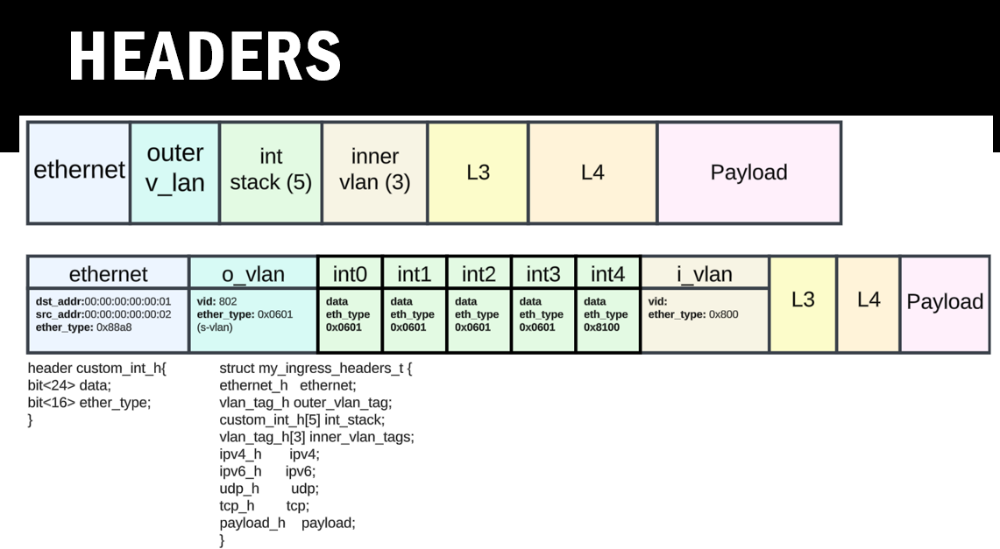
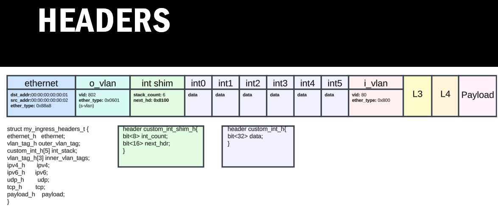

## SDE commands 

### Starting 

###### **Environment variables**

```shell
cd P4-INT/mysde/bf-sde-9.13.1/
. ~/tools/set_sde.bash
```

###### **Setup Veth interfaces**

```shell
sudo $SDE_INSTALL/bin/veth_setup.sh
```

## v1.1

### P4 Details

#### **Headers**



#### **Ingress**

* VLANs (both U-VLAN and S-VLAN) are processed at this stage. 
* This indicates that VLAN tagging, classification, and modifications occur early in the pipeline to prepare packets for downstream handling

| Action               | Ingress or Egress? | Reason                                                            |
| -------------------- | ------------------ | ----------------------------------------------------------------- |
| shift_int            | Ingress            | Shift INT metadata to align fields for further processing.        |
| push_int             | Ingress            | Add a new INT stack entry for monitoring or telemetry data.       |
| pop_int              | Ingress            | Remove an INT stack entry to finalize telemetry processing.       |
| pop_int_and_add_vlan | Ingress            | Remove INT metadata and add a VLAN tag for classification.        |
| pop_and_vlan         | Ingress            | Handle VLAN tagging after removing INT for downstream processing. |

#### **Egress**

* INT (In-band Network Telemetry) operations such as adding, modifying, or removing INT metadata are handled here. 


| **Action**            | **Ingress or Egress?** | **Reason**                                                                   |
| --------------------- | ---------------------- | ---------------------------------------------------------------------------- |
| shift_vlan            | Egress                 | Adjust VLAN fields for proper egress formatting.                             |
| remove_vlan           | Egress                 | Strip VLAN tags before final forwarding to ensure compatibility.             |
| add_s_vlan            | Egress                 | Add S-VLAN tags for marking traffic at the network edge.                     |
| add_int_metadata      | Egress                 | Insert INT metadata to track packet flow at the egress.                      |
| remove_s_vlan_and_int | Egress                 | Ensure packet is in the correct format by removing unnecessary tags and INT. |


###### **Compile the P4 program**

```shell
~/tools/p4_build.sh /home/xdp-int/INT-P4-project/v1.1/p4src/tofino/v1.1.p4
```

###### **Run the model:***

```shell
./run_tofino_model.sh -p v1.1
```


###### **Run the driver***

```shell
./run_switchd.sh -p v1.1
```


###### **Create pcaps for each case***

```shell
cd ~/INT-P4-project/v1.1/create_tests/wireshark
sudo chmod +x create_pcaps.sh
./create_pcaps.sh 
```

###### **Start the create test***

```shell
~/INT-P4-project/v1.1/create_tests
sudo chmod +x main.py
```

```shell
~/INT-P4-project/v1.1/create_tests
python3 main.py
```


## v1.2


### **P4 Details**

#### **Headers**



#### **Ingress**

* VLANs (both U-VLAN and S-VLAN) are processed at this stage.
* This indicates that VLAN tagging, classification, and modifications occur early in the pipeline to prepare packets for downstream handling.

| Action        | Ingress or Egress? | Reason                                 |
| ------------- | ------------------ | -------------------------------------- |
| forward       | Ingress            | Just forward the packet to the egress  |
| add_u_vlan    | Ingress            | Add U-VLAN to process it at the Egress |
| modify_u_vlan | Ingress            | Translate the U-VLAN                   |
#### **Egress**

* VLANs (both U-VLAN and S-VLAN) are processed at this stage. 
* This indicates that VLAN tagging, classification, and modifications occur early in the pipeline to prepare packets for downstream handling.


| Action        | Ingress or Egress? | Reason                                                                                 |
| ------------- | ------------------ | -------------------------------------------------------------------------------------- |
| modify_s_vlan | Egress             | Modifies the S-VLAN to reflect service-specific updates after adding the INT metadata. |
| modify_s_vlan | Egress             | Modifies the S-VLAN to reflect service-specific updates after adding the INT metadata. |
| modify_s_vlan | Egress             | Modifies the S-VLAN to reflect service-specific updates after adding the INT metadata. |
| modify_s_vlan | Egress             | Modifies the S-VLAN to reflect service-specific updates after adding the INT metadata. |
| modify_s_vlan | Egress             | Modifies the S-VLAN to reflect service-specific updates after adding the INT metadata. |

###### **Compile the P4 program**

```shell
~/tools/p4_build.sh /home/xdp-int/INT-P4-project/v1.2/p4src/tofino/v1.2.p4
```


###### **Run the model:***

```shell
./run_tofino_model.sh -p v1.2
```


###### **Run the driver***

```shell
./run_switchd.sh -p v1.2
```

###### **Create pcaps for each case***

```shell
cd ~/INT-P4-project/v1.2/create_tests/wireshark
sudo chmod +x create_pcaps.sh
./create_pcaps.sh 
```

###### **Start the create test***

```shell
~/INT-P4-project/v1.2/create_tests
sudo chmod +x main.py
```

```shell
~/INT-P4-project/v1.2/create_tests
python3 main.py
```

